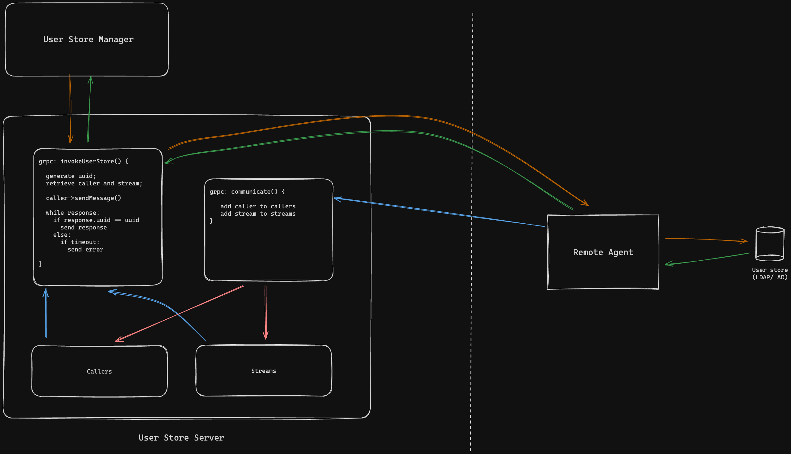

# GRPC Bi-Directional Remote User Store Sample

This project contains a GRPC user store server, a GRPC remote client and a sample user store manager.

For the demonstration purposes, the project only supports user authentication against a set of locally stored user credentials.

This involves running a bi-directional gRPC server and a client application that communicates with an on premise user store to perform user operations such as authentication.

The client should be kept private in a local environment and should only allow outbound communications to the server endpoint. The client initiates the connection with the server and creates a bi-directional communication channel.

The GRPC server exposes a GRPC endpoint to connect from third party applications such as the provided user store manager sample.



### How to run

1. navigate to the `userstore-server` directory and run the following command:

   ```bash
   bal run
   ```
   
2. navigate to the `remote-client` directory and run the following command:

   ```bash
   bal run
   ```

3. Invoke the server with the following grpc command to authenticate a user:

   - Endpoint: grpc://localhost:9092
   - Method: UserStoreServer/authenticate
   - Payload:
     ```json
     {
         "username": "user1",
         "password": "user1",
         "organization": "test_org_1"
     }
     ```

## Troubleshooting

### Enable Debug Logs

Create a file named `Config.toml` in the directory where you'll be running the ballerina command with the following content:

```toml
[ballerina.log]
level = "DEBUG"
```
