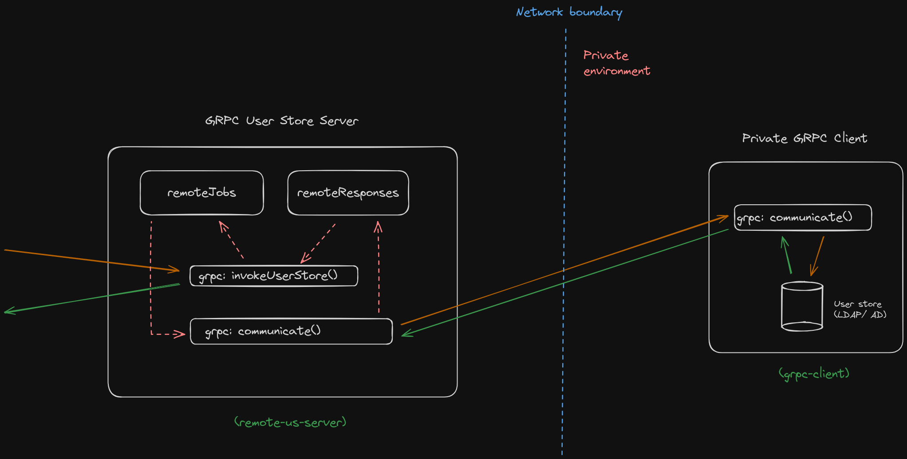

# GRPC Bi-Directional Remote User Store Sample (Ballerina)

This project contains a user store server and a remote client that can be operated in two modes.

1. Private Remote Client (GRPC)
2. Public Remote Client (REST)

For the demonstration purposes, the project only supports user authentication against a set of locally stored user credentials.

## Private Remote Client

This mode involves running a bi-directional gRPC server and a client application that communicates with an on premise user store to perform user operations such as authentication.

The client should be kept private in a local environment and should only allow outbound communications to the server endpoint. The client initiates the connection with the server and creates a bi-directional communication channel. Both parties will keep the communication alive by sending heart beat messages.

The server exposes a GRPC endpoint to connect from third party applications.



### How to run

1. navigate to the `userstore-server` directory and run the following command:
    ```bash
    bal run
    ```

2. navigate to the `remote-client` directory and run the following command:
    ```bash
    bal run
    ```

3. Invoke the server with the following grpc command to authenticate a user:
    - Endpoint: grpc://localhost:9090
    - Method: RemoteUserStore/invokeUserStore
    - Payload:
        ```json
        {
            "organization": "test_org_1",
            "operationType": "DO_AUTHENTICATE",
            "data": {
                "fields": {
                    "username": {
                        "string_value": "user1"
                    },
                    "password": {
                        "string_value": "user1"
                    }
                }
            }
        }
        ```

    

## Public Remote Client

This mode involves running a REST service that communicates with an on premise user store to perform user operations such as authentication.

The client should be running in the local environment where the user store resides, and should allow both inbound and outbound communications from third party applications.

The client exposes a REST endpoint to connect from third party applications.

### How to run

1. navigate to the `remote-client` directory and create a new file named `Config.toml` with the following content:
    ```toml
    clientMode="PUBLIC"
    ```

2. Run the following command in the same directory:
    ```bash
    bal run
    ```

3. Invoke the remote client with the following curl command to authenticate a user:
    ```bash
    curl --location 'http://localhost:9095/invoke-userstore' \
    --header 'Content-Type: application/json' \
    --data '{
        "id": "1234",
        "operationType": "DO_AUTHENTICATE",
        "data": {
            "username": "user1",
            "password": "user1"
        }
    }'
    ```

    

## Troubleshooting

### Enable Debug Logs

Create a file named `Config.toml` in the directory where you'll be running the ballerina command with the following content:

```toml
[ballerina.log]
level = "DEBUG"
```
