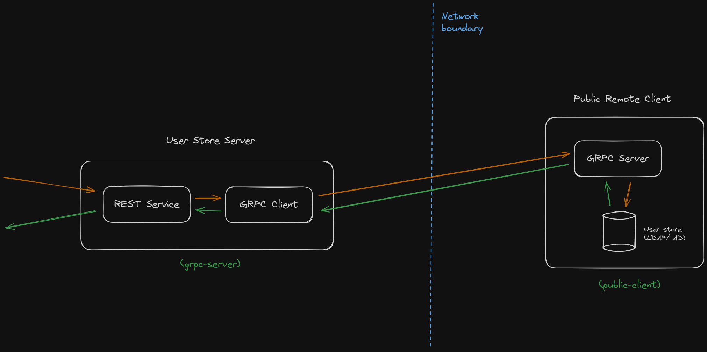

# Simple GRPC Remote User Store Sample

This project contains a simple gRPC server and a client application that communicates with an on premise user store to perform user operations such as authentication.

For the demonstration purposes, the project only supports user authentication against a set of locally stored user credentials.

The server exposes a REST API to connect from third party applications.



## How to run

1. navigate to the `grpc-server` directory and run the following command:
    ```bash
    bal run
    ```

2. navigate to the `public-client` directory and run the following command:
    ```bash
    bal run
    ```

3. Invoke the following curl command to authenticate a user:
    ```bash
    curl --location 'http://localhost:8090/call-remote/authenticate' \
    --header 'Content-Type: application/json' \
    --data '{
        "username": "test1",
        "password": "test1"
    }
    '
    ```

    
